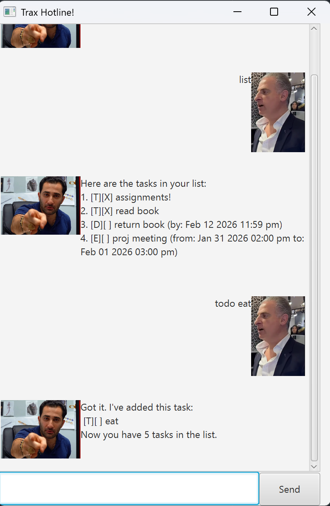
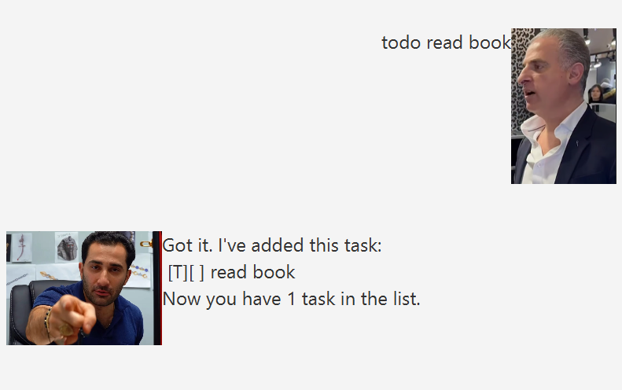
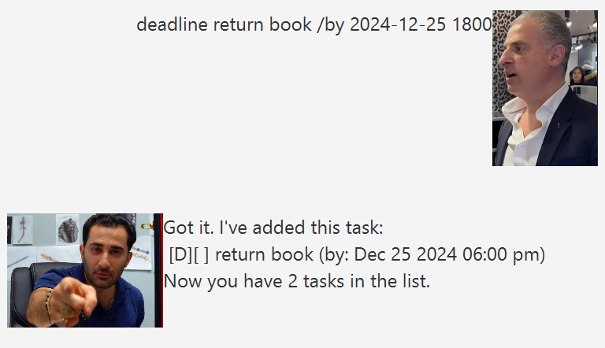
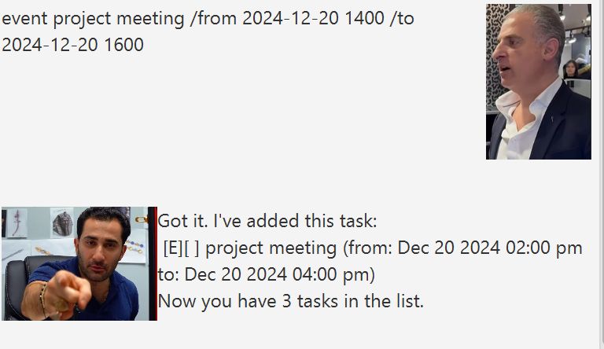
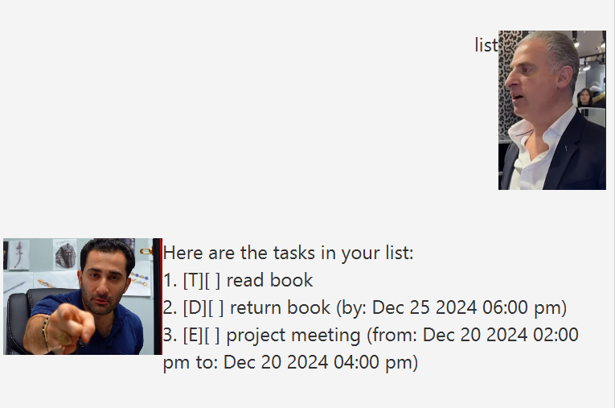
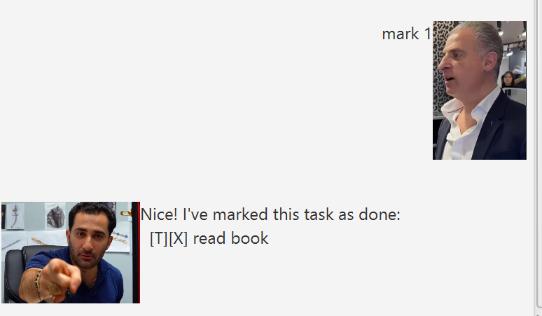
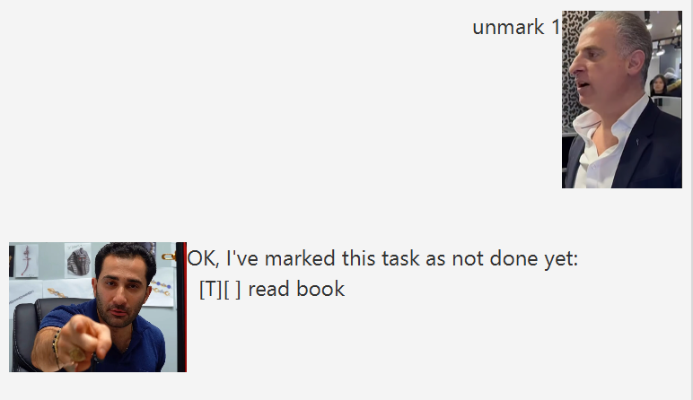
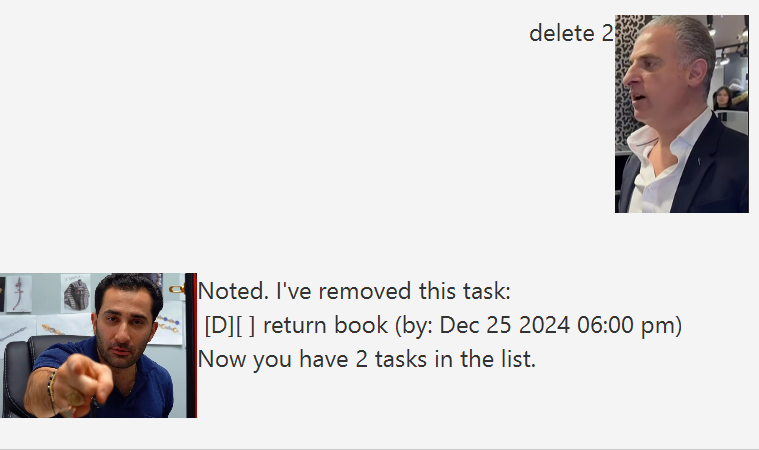
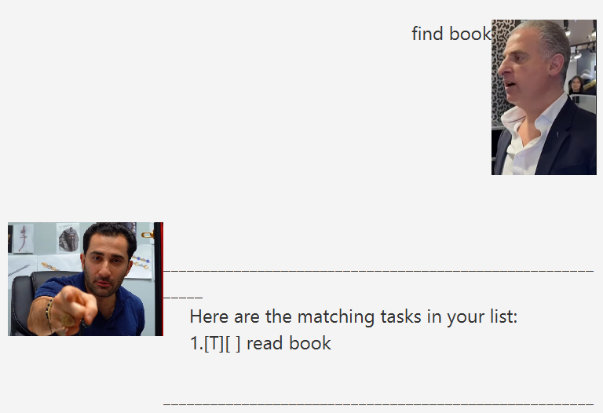

# Trax User Guide

Trax is a command-line and JavaFX-based task management application that helps you keep track of your todos, deadlines, and events.



---

## Table of Contents
- [Features](#features)
- [Getting Started](#getting-started)
- [Commands](#commands)
- [Date Format](#date-format)
- [Data Storage](#data-storage)
- [Command Reference](#command-reference)


## Features
- Add three types of tasks: Todos, Deadlines, and Events
- Mark tasks as done/not done
- Delete tasks
- Find tasks by keyword
- Automatic saving to local storage

## Getting Started

1. Prerequisites: ensure you have Java 17 or above installed.
   ```
   java -version
   ```
2. Download the latest `trax.jar` from [here](https://github.com/jacksoncddd/ip/releases).
3. Run the app:
   ```
   java -jar trax.jar
   ```


## Commands

| Command | Format                                                                 | Example |
|---------|------------------------------------------------------------------------|---------|
| Add Todo | `td/todo <description>`                                                | `todo read book` |
| Add Deadline | `dl/deadline <description> /by <yyyy-MM-dd HHmm>`                      | `deadline return book /by 2024-12-25 1800` |
| Add Event | `ev/event <description> /from <yyyy-MM-dd HHmm> /to <yyyy-MM-dd HHmm>` | `event meeting /from 2024-12-20 1400 /to 2024-12-20 1600` |
| List Tasks | `list`                                                                 | `list` |
| Mark Done | `mark <number>`                                                        | `mark 1` |
| Unmark | `unmark <number>`                                                      | `unmark 1` |
| Delete | `delete <number>`                                                      | `delete 2` |
| Find | `find <keyword>`                                                       | `find book` |
| Exit | `bye`                                                                  | `bye` |

*Commands td, dl and ev are command shortcuts.

## Date Format

Use `yyyy-MM-dd HHmm` format for dates and times:
- Year: 4 digits (e.g., 2024)
- Month: 2 digits (01-12)
- Day: 2 digits (01-31)
- Time: 24-hour format (e.g., 1800 = 6:00 PM)

## Data Storage

Tasks are automatically saved to `./data/tasks.txt` and loaded on startup.


## Command Reference

### 1. Add a Todo
**Format:** `todo <description>`

**Example:**
```
todo read book
```

**Output:**
```
Got it. I've added this task:
 [T][ ] read book
Now you have 1 task in the list.
```



---

### 2. Add a Deadline
**Format:** `deadline <description> /by <yyyy-MM-dd HHmm>`

**Example:**
```
deadline return book /by 2024-12-25 1800
```

**Output:**
```
Got it. I've added this task:
 [D][ ] return book (by: Dec 25 2024 06:00 PM)
Now you have 2 tasks in the list.
```

**Date Format:** `yyyy-MM-dd HHmm`
- `yyyy`: 4-digit year (e.g., 2024)
- `MM`: 2-digit month (01-12)
- `dd`: 2-digit day (01-31)
- `HHmm`: 24-hour time (e.g., 1800 = 6:00 PM)



---

### 3. Add an Event
**Format:** `event <description> /from <yyyy-MM-dd HHmm> /to <yyyy-MM-dd HHmm>`

**Example:**
```
event project meeting /from 2024-12-20 1400 /to 2024-12-20 1600
```

**Output:**
```
Got it. I've added this task:
 [E][ ] project meeting (from: Dec 20 2024 02:00 PM to: Dec 20 2024 04:00 PM)
Now you have 3 tasks in the list.
```


---

### 4. List All Tasks
**Format:** `list`

**Example:**
```
list
```

**Output:**
```
Here are the tasks in your list:
1. [T][ ] read book
2. [D][ ] return book (by: Dec 25 2024 06:00 PM)
3. [E][ ] project meeting (from: Dec 20 2024 02:00 PM to: Dec 20 2024 04:00 PM)
```


---

### 5. Mark Task as Done
**Format:** `mark <task number>`

**Example:**
```
mark 1
```

**Output:**
```
Nice! I've marked this task as done:
  [T][X] read book
```


---

### 6. Unmark Task
**Format:** `unmark <task number>`

**Example:**
```
unmark 1
```

**Output:**
```
OK, I've marked this task as not done yet:
  [T][ ] read book
```

---

### 7. Delete Task
**Format:** `delete <task number>`

**Example:**
```
delete 2
```

**Output:**
```
Noted. I've removed this task:
 [D][ ] return book (by: Dec 25 2024 06:00 PM)
Now you have 2 tasks in the list.
```


---

### 8. Find Tasks
**Format:** `find <keyword>`

**Example:**
```
find book
```

**Output:**
```
    ____________________________________________________________
     Here are the matching tasks in your list:
     1.[T][] read book
    ____________________________________________________________
```

**Features:**
- Case-insensitive search
- Partial matching (searches within descriptions)



---

### 9. Exit Application
**Format:** `bye`

**Example:**
```
bye
```

**Output:**
```
Bye. Hope to see you again soon!
```

